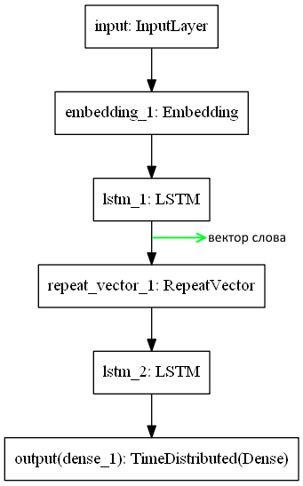

# Вопросно-ответная диалоговая система

## Консольный фронтенд для бота

Реализован в файле [test_simple_console_answering_machine.py](https://github.com/Koziev/chatbot/blob/master/PyModels/bot/test_simple_console_answering_machine.py)

## Чатбот для Telegram

Реализован в файле [test_telegram_bot.py](https://github.com/Koziev/chatbot/blob/master/PyModels/bot/test_telegram_bot.py)

## Тренировка и использование модели посимвольного встраивания слов

Модели чат-бота при работе используют разные способы векторного представления слов.
Один из использованных алгоритмов векторизации заключается в упаковке посимвольного
представления слова с помощью сжимающего рекуррентного автоэнкодера:

На вход подается цепочка символов слова. Эта цепочка упаковывается в вектор фиксированной
длины с помощью LSTM-слоя. Вектор, получаемый на выходе этого слоя содержит всю информацию
о символах, 2-граммах и т.д. в исходном слове. Это позволяет прочим моделям учитывать как семантическую, там и морфологическую близость слов. К примеру,
слова "использован" и "использовал" в большинстве языковых контекстов образуют близкие
по смыслу предложения благодаря общему корню. В других ситуация важную информацию несут
суффиксы, окончания или приставки. Посимвольные встраивания слов доставляют эту информацию.

Выходная часть автоэнкодера, как обычно, восстанавливает исходную цепочку символов слова из
вектора.

Для тренировки посимвольных встраиваний необходимо выполнить два шага.

Во-первых, сгенерировать список слов. Эту задачу выполняет скрипт [prepare_wordchar_dataset.py](https://github.com/Koziev/chatbot/blob/master/PyModels/prepare_wordchar_dataset.py).
Он читает несколько других датасетов и текстовых файлов и сохраняет итоговый список
слов в файле [../tmp/known_words.txt](https://github.com/Koziev/chatbot/blob/master/tmp/known_words.txt).
Вариант этого файла выложен в репозиторий, поэтому первый шаг можно пропустить.

Во-вторых, запустить тренировку модели скриптом [wordchar2vector.py](https://github.com/Koziev/chatbot/blob/master/PyModels/wordchar2vector.py).
Скрипт предлагает два режима выполнения - тренировка модели с нуля или загрузка ранее натренированной модели
для векторизации нового списка слов. Второй режим позволяет быстро векторизовать лексикон
после добавления новых предложений в исходные датасеты, не переучивая нейросеть.

Тренировочный скрипт сохраняет на диске также саму модель (файлы с метаданными для восстановления
нейросетки и веса). Поэтому новые слова в поступающих от собеседника фразах можно
векторизовать на лету, если в готовом наборе векторов их еще нет.

Тренировка модели сопровождается наглядной визуализацией текущего состояния модели:

